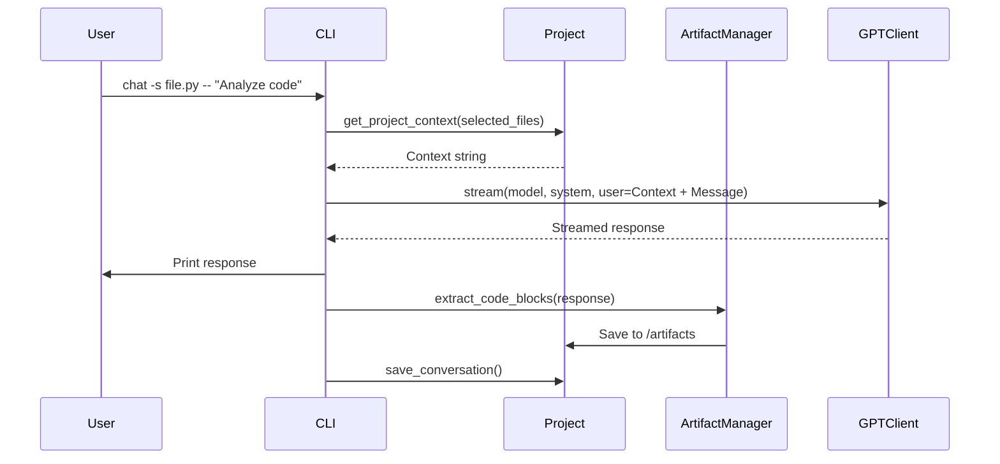

# ChatGPT Projects CLI (v5)

[](https://www.python.org/downloads/)
[](LICENSE)
[](https://openai.com/)

A command-line interface (CLI) tool for managing isolated coding projects and interacting with OpenAI's GPT models (e.g., GPT-5, GPT-4o). It provides project sandboxing, AI-assisted code analysis, automatic artifact extraction, token/cost estimation, and robust API handling. Designed for developers seeking a "website-parity" experience in the terminal, with strict scope control to prevent data leakage.

## Features

- **Project Isolation**: Each project is a self-contained directory with files, artifacts, conversations, and metadata. GPT sees *only* the current project's files.
- **AI Chat**: Query GPT with optional file context inclusion. Supports flags for no context (`-n`), selective files (`-s`), file-based messages (`-f`), and multi-line input (`-m`).
- **Artifact Extraction**: Automatically saves large code blocks from responses as versioned files in `/artifacts`.
- **Conversation Logging**: Saves chats as JSON; consolidated history in `project_history.json` for easy auditing.
- **Model Management**: Switch between aliases (e.g., `gpt5` for GPT-5) or exact IDs. Live model listing from OpenAI API.
- **Token & Cost Awareness**: Precise estimation using `tiktoken` (fallback heuristic); pricing projections based on input/output rates.
- **Streaming Responses**: Prefers Responses API for real-time output; auto-falls back to non-streaming or Chat Completions if restricted (e.g., org policies).
- **Utilities**: File syncing, exporting, viewing, and folder opening in system explorer.

## Installation

1. Clone the repository:
   ```
   git clone https://github.com/your-repo/ChatGPTProjects.git
   cd ChatGPTProjects
   ```

2. Install dependencies:
   ```
   pip install --upgrade openai python-dotenv tiktoken
   ```

3. Set your OpenAI API key in a `.env` file:
   ```
   OPENAI_API_KEY=sk-...
   ```

4. Run the CLI:
   ```
   python ChatGPTProjects_v5.py
   ```

## Usage

### Quick Start

```
(create) my_project
(add) path/to/script.py
(files)  # List files
(chat) Analyze and improve this code
(artifacts)  # View extracted code blocks
(history)  # View chat history
```

### Commands Overview

- **Project Management**:
  - `create <name>`: Create a new project.
  - `open <name>`: Open an existing project.
  - `projects`: List all projects.

- **File Operations**:
  - `add <path>`: Add a file to the project.
  - `files`: List files with sizes and modification dates.
  - `remove <filename>`: Remove a file.
  - `update`: Sync metadata with filesystem.
  - `view <filename>`: Display file content with token estimate.
  - `tokens`: Analyze token usage per file and total.

- **AI Interactions**:
  - `chat <message>`: Chat with full project context.
    - `-n`: No context.
    - `-s file1,file2 --`: Selective files.
    - `-f <filename>`: Message from file.
    - `-m`: Multi-line input (end with EOF).
  - `model <alias|id>`: Switch models (e.g., `4o` for GPT-4o).
  - `models`: List aliases and API models.
  - `pricing --model <id> --estimate-tokens <int> --in-ratio <float> --throughput-tps <float>`: Estimate costs.

- **Artifacts & Export**:
  - `artifacts`: List extracted artifacts.
  - `export artifacts [path]`: Export artifacts.
  - `export files [path]`: Export files.
  - `clear_artifacts`: Delete artifacts (with confirmation).

- **Meta**:
  - `conversations`: List chat logs.
  - `history [N]`: Show last N history entries (default 10).
  - `open_project_folder`: Open project dir in file manager.
  - `help`: Command reference.

For detailed help: `help <command>` in the CLI.

## Architecture

### High-Level Diagram

```
+-------------------------+     +-------------------------+
|        CLI Layer        |     |     Data Storage        |
| (ChatGPTCLI: cmd.Cmd)   |     | (JSON/Metadata/Files)   |
| - Commands: create, chat|     | - Project dirs          |
| - Prompt handling       |<--->| - conversations/        |
+-------------------------+     | - files/                |
                               +-------------------------+
                                      ^
                                      |
                                      v
+-------------------------+     +-------------------------+
|    Business Logic       |     |     API Integration     |
| - Project: file mgmt    |<--->| (GPTClient: OpenAI)     |
| - ArtifactManager: code |     | - Responses/Chat Comps  |
+-------------------------+     | - Streaming fallbacks   |
                               +-------------------------+
```

- **CLI Layer**: Handles user input via `cmd.Cmd` REPL.
- **Business Logic**: `Project` class enforces isolation; `ArtifactManager` uses regex for code extraction.
- **API Integration**: Abstracts OpenAI with fallbacks for API variations.
- **Storage**: Filesystem-based; e.g., `metadata.json` tracks file metadata.

### Chat Workflow (Mermaid Diagram)



## Technical Details

### Token Limits & Estimation

- **Context Window**: Defaults to 200,000 tokens (configurable via `TOKEN_LIMIT`). Based on GPT-5 capabilities; adjust for smaller models.
- **Estimation**: Uses `tiktoken` with `o200k_base` encoding for accuracy. Fallback: `len(text) / 4` (conservative heuristic).
- **Budget Enforcement**: Pre-chat check: context + message + 2000 overhead < limit - 5000 buffer. Aborts if exceeded; suggests using `-n` or `-s`.
- **Per-File Analysis**: `tokens` command sorts files by token count, with color-coded warnings (green <20k, yellow <50k, red >50k).

### Pricing Calculations

- **Rates Table** (`PRICING_USD_PER_1K`):
  | Model       | Input ($/1K) | Output ($/1K) |
  |-------------|--------------|---------------|
  | gpt-5      | 0.00        | 0.00         |
  | gpt-4.1    | 5.00        | 15.00        |
  | gpt-4o     | 5.00        | 15.00        |
  | gpt-4o-mini| 0.30        | 1.20         |

- **Formulas**:
  - One-shot: `(in_tokens / 1000) * input_rate + (out_tokens / 1000) * output_rate`.
  - Hourly: `(tps * 3600) * (0.5 * (input_rate + output_rate) / 1000)`.
- **Defaults**: 50% input ratio, 200k tokens, 30 tok/s throughput.
- **Update Tip**: Edit the dict in code for new models/rates.

### Model Choice & API Handling

- **Aliases**: `gpt5` → `gpt-5`, `4.1` → `gpt-4.1`, etc. Custom IDs supported.
- **API Preference**: Responses API (website-like, no temperature param to avoid errors). Fallbacks:
  1. Non-streaming Responses.
  2. `instructions` variant.
  3. Chat Completions (streaming/non-streaming, with temperature=0.2).
- **Error Resilience**: Catches 400s (e.g., stream not allowed) and retries appropriately.
- **System Prompt**: Engineering-focused: "Produce complete, runnable code... # deps: ..." for dependencies.

## Limitations

- No multimodal support (text-only).
- No internet/package installs in code execution (if extended via tools).
- Relies on OpenAI API; costs apply.
- Artifacts: Skips blocks <100 chars; regex-based (triple-backticks).

## Contributing

Fork, PR, or open issues. Licensed under MIT.

## Acknowledgments

Built with OpenAI SDK. Inspired by ChatGPT web workflows.
